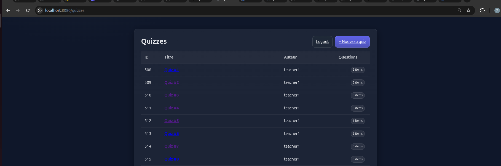
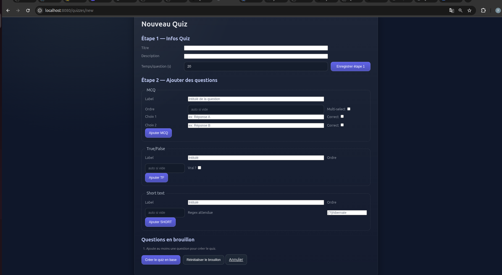
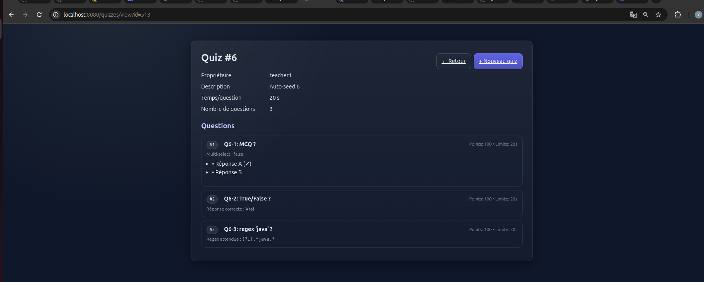
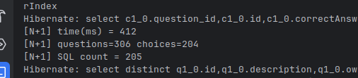
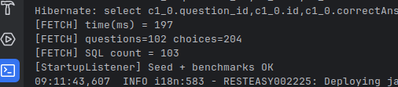

# TP1–TP2 : Servlets/JSP + JAX-RS (RESTEasy) + OpenAPI

## Objectif

Mini-app “Kahoot” qui combine :
- **TP1** — IHM **Servlets + JSP (JSTL)** : lister, créer (brouillon multi-étapes), afficher le détail d’un quiz.
- **TP2** — **API REST JAX-RS** (RESTEasy) + **OpenAPI/Swagger UI** pour documenter et tester l’API.
- **Seed au démarrage** (ServletContextListener) + **démo N+1** vs **`JOIN FETCH`** avec Hibernate.

---

## Aperçu (captures)

<p align="center">
  
</p>

<p align="center">
  
</p>

<p align="center">
  
</p>

<p align="center">
  
</p>

<p align="center">
  
  
</p>

---

## Ce qui a été fait

### TP1 — IHM Servlets/JSP
- **Pages**
    - Liste : `GET /quizzes`
    - Nouveau quiz (brouillon MCQ/TF/SHORT) : `GET /quizzes/new`
    - Détail : `GET /quizzes/view?id={id}`
- **Brouillon en session** : les champs de l’étape 1 (titre/description/temps) sont conservés via inputs cachés lors de l’ajout de questions.
- **Rendu typé** dans la JSP de détail via `c:choose` + propriété Java `getQType()` (TF/MCQ/SHORT).
- **Performances** liste : agrégation en SQL pour afficher le **compte de questions** (évite `N+1`).

### TP2 — API JAX-RS + OpenAPI (Swagger UI)
- **Endpoints (prefix `/api`)**
    - `GET /api/quizzes?page=0&size=20` — liste paginée
    - `GET /api/quizzes/{id}` — détail
    - `POST /api/quizzes` — création via `QuizCreateDto`
    - `DELETE /api/quizzes/{id}` — suppression
- **Spéc OpenAPI** : `GET /api/openapi`
- **Swagger UI (webjar)** : `GET /swagger-ui` → charge automatiquement `/api/openapi`.

### Seed + Benchmarks Hibernate
- Au démarrage (**StartupServletListener**) :
    - création de `teacher1`, `player1`,
    - génération de **100 quizzes** (3 questions : MCQ, TF, SHORT),
    - exécution de deux runs :
        - **N+1** (accès LAZY en boucles) → beaucoup de requêtes / temps plus long,
        - **JOIN FETCH** (`left join fetch qz.questions` + `treat(MCQ).choices`) → ~2× plus rapide, ~50% de requêtes en moins.

---

## Lancer le projet

```bash
mvn clean compile jetty:run
